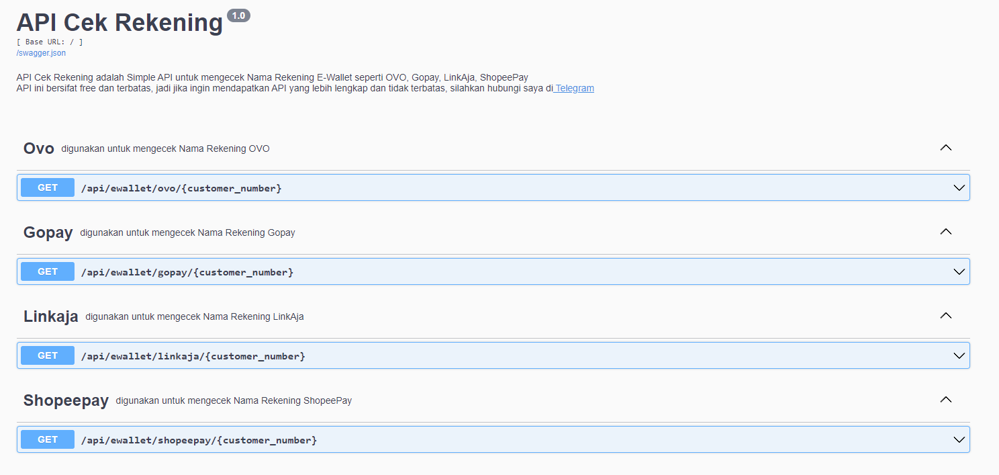

# API Cek Rekening

API Cek Rekening adalah API yang dibuat untuk mempermudah dalam melakukan pengecekan nama pemilik rekening Ewallet.
Di repository ini API versi 1.0.0 Basic. Jika ingin menggunakan API versi 1.0.0 Pro atau memiliki full standalone
script, silahkan hubungi di
telegram [@sandroputraa](https://t.me/sandroputraa)

Versi pro di-host di repositori pribadi. Akses berbayar. akan mendapatkan dukungan dasar untuk instalasi, konfigurasi,
dan penggunaan. tersedia request fitur yang lainya.


## Daftar Isi
  * [Fitur](#fitur)
  * [Contoh Penggunaan dengan curl](#contoh-penggunaan-dengan-curl)
  * [Dokumentasi API](#dokumentasi-api)


## Fitur

| Fitur             | Deskripsi                           | Versi       |
|-------------------|-------------------------------------|-------------|
| Cek OVO           | Cek nama pemilik rekening OVO       | Pro & Basic |
| Cek Gopay         | Cek nama pemilik rekening Gopay     | Pro & Basic |
| Cek LinkAja       | Cek nama pemilik rekening LinkAja   | Pro & Basic |
| Cek ShopeePay     | Cek nama pemilik rekening ShopeePay | Pro & Basic |
| Unlimited Request | Unlimited API request               | Pro         |

#### Untuk versi Basic, hanya mendukung 100 request per hari dan 10 request per menit.

Jika ingin custom request, silahkan hubungi di telegram [@sandroputraa](https://t.me/sandroputraa)


## Contoh Penggunaan dengan curl

#### Base URL API : http://47.88.53.4:3333/api/

#### Request Index API

```bash
curl -X GET "http://47.88.53.4:3333/api/docs" -H "accept: application/json"
```

#### Output

```json
{
  "documentation": "/api/docs",
  "message": "Welcome to Check Ewallet API",
  "servertime": "31/03/2023 12:52:20",
  "status": true
}
```

#### Request Cek LinkAja

```bash
curl -X 'GET' \
  'http://47.88.53.4:3333/api/ewallet/linkaja/{customerNumber}' \
  -H 'accept: application/json'
```

| Parameter      | Tipe Data | Deskripsi                               |
|----------------|-----------|-----------------------------------------|
| customerNumber | string    | Nomor rekening Ewallet yang akan dicek. |


#### Output

```json
{
  "status": true,
  "CustomerNumber": "xxx xxx xxx",
  "CustomerName": "xxx xxx xxx",
  "EwalletType": "linkaja"
}
```

## Dokumentasi API

Untuk demo dan dokumentasi API lebih lengkap dapat dilihat di [Swagger Documentation](http://47.88.53.4:3333/api/docs) berikut ini
adalah screenshot dokumentasi API

****


## Support

Untuk mendapatkan dukungan lebih lanjut, silahkan hubungi di telegram [@sandroputraa](https://t.me/sandroputraa)
